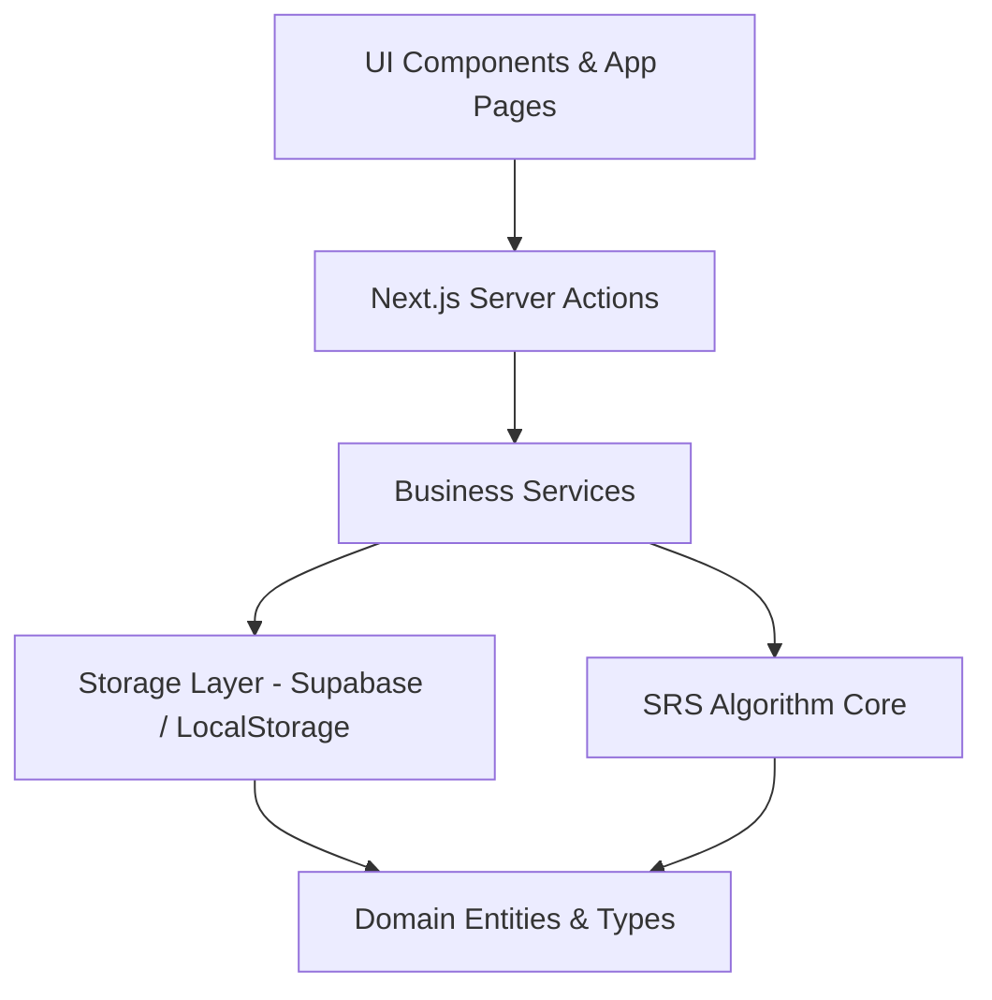

# EmbedStudio Codebase Architecture & File Index

This document maps out the architecture, directories, database schema, and key workflows of the **EmbedStudio** (Keli-Embed) project. It serves as a structural map and file index to reduce token consumption during future queries by providing clickable file links and architectural context.

---

## 🗺️ System Overview

**EmbedStudio** is a web-based learning and interview preparation platform for embedded systems engineers. It uses a **Spaced Repetition System (SRS)** (based on a modified SM-2 algorithm) to schedule question reviews and help users efficiently memorize flashcards across multiple domains like:
*   **C/C++ Language** (`c-language`)
*   **Microcontrollers & Hardware** (`mcu`)
*   **Real-Time Operating Systems** (`rtos`)
*   **Communication Protocols** (`protocol`)
*   **Embedded Linux** (`linux-embedded`)
*   **Algorithms** (`algorithm`)
*   **Hardware Basics** (`hardware`)
*   **Mixed Interviews** (`interview-mixed`)

---

## 🏗️ Layered Architecture

The project is built with a **strict layered architecture** where dependencies flow in one direction (Domain ➡️ SRS/Storage Interfaces ➡️ Services ➡️ Actions ➡️ UI). Boundaries are checked at compile time using custom ESLint import boundary rules.

### 1. Domain Layer (`lib/domain/`)
Defines the core typescript interfaces and pure data structures representing entities in the system.
*   **Question**: The card content, metadata (difficulty, direction, companies, year, round, tags), and type (concept, choice, code-reading).
*   **CardState**: The user's progress on a question (ease factor, interval days, repetitions, due date, isWeak flag, last rating).
*   **ReviewLog**: Records history of every single submission for stats and heatmap computations.
*   **User**: User profile data (daily goals, streak count, activity timestamp).

### 2. SRS Algorithm Core (`lib/srs/`)
Pure, framework-agnostic mathematical operations governing the spaced-repetition logic.
*   **Scheduling (`schedule.ts`)**: Adjusts `easeFactor`, `intervalDays`, and computes `dueAt` based on the rating input (`again`, `hard`, `good`, `easy`).
*   **Queue Generation (`queue.ts`)**: Generates today's prioritized card queue.
    *   **Priority 0**: Marked weak cards (`isWeak = true`).
    *   **Priority 1**: Due review cards (`dueAt <= now` and not weak).
    *   **Priority 2**: Fresh cards (`totalReviews = 0`), picking in a round-robin style across active directions, starting with the easiest.
*   **Weak Point Manager (`weak-mark.ts`)**: Flags items as weak points (`isWeak = true`, due immediately) when starred, and automatically unmarks them after a streak of high ratings (`good` or `easy`).

### 3. Storage Abstraction Layer (`lib/storage/`)
Abstracts storage behind TypeScript interfaces (`CardStore`, `QuestionStore`, `ReviewLogStore`, `ProfileStore`).
*   **Supabase Storage (`lib/storage/supabase/`)**: Cloud-first production implementation.
    *   Integrates Row Level Security (RLS) on Postgres.
    *   Uses a Postgres RPC function (`save_review_with_log`) to guarantee atomic transaction integrity for saving card state and creating review logs in one execution.
*   **Local Storage (`lib/storage/local/`)**: Client-side offline/test implementation. Uses standard browser `localStorage` or falls back to an in-memory Map in non-browser testing environments.

### 4. Business Services Layer (`lib/services/`)
Pure business logic connecting storage clients with the SRS engine.
*   `review-service.ts`: Orchestrates submission of ratings, scheduling computations, weak point checks, and transaction logs.
*   `queue-service.ts`: Fetches due and weak cards from storage, pulls candidates for new cards, and constructs the sorted queue.
*   `stats-service.ts`: Aggregates reviews, calculates streaks, and computes percentage progress across domains.

### 5. Next.js Server Actions Layer (`lib/actions/`)
Next.js `use server` boundaries. Serves as controller endpoints for client components.
*   Extracts authentication state (`userId`) from the request cookies using Supabase Auth.
*   Instantiates the concrete `SupabaseStore` instances.
*   Delegates actions to services and returns serialized results.

### 6. Content Sync Pipeline (`lib/content/`)
Imports markdown-based question definitions from the repository code directly into the database.
*   Parses standard YAML frontmatter with a custom parser (`parse-markdown.ts`).
*   Validates constraints and warns for missing content features (`validate.ts`).
*   Runs bulk updates via a service role client to populate production data (`sync.ts`).

### 7. UI Layer (`app/` & `components/`)
A responsive, premium Next.js UI using Tailwind CSS v4 and Base UI / Radix.
*   **Review Deck**: Tinder-style draggable and swipeable card deck supporting keyboard and gesture interactions.
*   **Mastery Tracking**: Optimistic React context (`MasteryProvider`) that immediately updates card status locally while syncing changes in the background.

---

## 🗄️ Database Schema & Migrations

The database resides in Supabase Postgres, using RLS policies targeting `auth.uid()`.

### Tables Overview
1.  **`directions`**: Flashcard categories (C Language, MCU, RTOS, Protocols, etc.).
2.  **`companies`**: Target employers (Huawei, DJI, Xiaomi, Hikvision, BYD).
3.  **`questions`**: Question content definitions synced from markdown files.
4.  **`user_card_states`**: Maps users (`user_id`) to cards (`question_id`). Tracks SRS metadata (due dates, repetitions, difficulty rating).
5.  **`review_logs`**: Chronological review attempt history, used to calculate streaks and heatmaps.
6.  **`user_profiles`**: Tracks user daily targets, active streaks, and profile details.

---

## 📂 File Directory & Index

Below is the index of key files in the workspace. Click on the links to inspect files directly.

### 🧩 Domain Entities & Core Types
*   [Domain Barrel](file:///Users/zachary/Desktop/EmbedStudio/lib/domain/index.ts)
*   [card-state.ts](file:///Users/zachary/Desktop/EmbedStudio/lib/domain/card-state.ts) — Card state structures and defaults.
*   [question.ts](file:///Users/zachary/Desktop/EmbedStudio/lib/domain/question.ts) — Question schema, choice structures, and interview tags.
*   [review-log.ts](file:///Users/zachary/Desktop/EmbedStudio/lib/domain/review-log.ts) — Review log definition.
*   [rating.ts](file:///Users/zachary/Desktop/EmbedStudio/lib/domain/rating.ts) — Review ratings (`again`, `hard`, `good`, `easy`).
*   [user.ts](file:///Users/zachary/Desktop/EmbedStudio/lib/domain/user.ts) — User profile structure.

### 🧠 Spaced Repetition Engine
*   [SRS Barrel](file:///Users/zachary/Desktop/EmbedStudio/lib/srs/index.ts)
*   [schedule.ts](file:///Users/zachary/Desktop/EmbedStudio/lib/srs/schedule.ts) — Modified SM-2 scheduling algorithm.
*   [queue.ts](file:///Users/zachary/Desktop/EmbedStudio/lib/srs/queue.ts) — Queue builder and round-robin new card selector.
*   [weak-mark.ts](file:///Users/zachary/Desktop/EmbedStudio/lib/srs/weak-mark.ts) — Marking and streak-based clearing of weak points.

### 💾 Storage Interfaces & Implementations
*   [Storage Barrel](file:///Users/zachary/Desktop/EmbedStudio/lib/storage/index.ts)
*   [card-store.ts (Interface)](file:///Users/zachary/Desktop/EmbedStudio/lib/storage/card-store.ts)
*   [question-store.ts (Interface)](file:///Users/zachary/Desktop/EmbedStudio/lib/storage/question-store.ts)
*   [review-log-store.ts (Interface)](file:///Users/zachary/Desktop/EmbedStudio/lib/storage/review-log-store.ts)
*   [profile-store.ts (Interface)](file:///Users/zachary/Desktop/EmbedStudio/lib/storage/profile-store.ts)
*   **Local Storage Implementations:**
    *   [Local Storage Barrel](file:///Users/zachary/Desktop/EmbedStudio/lib/storage/local/index.ts)
    *   [card-store.ts](file:///Users/zachary/Desktop/EmbedStudio/lib/storage/local/card-store.ts)
    *   [question-store.ts](file:///Users/zachary/Desktop/EmbedStudio/lib/storage/local/question-store.ts)
    *   [review-log-store.ts](file:///Users/zachary/Desktop/EmbedStudio/lib/storage/local/review-log-store.ts)
    *   [profile-store.ts](file:///Users/zachary/Desktop/EmbedStudio/lib/storage/local/profile-store.ts)
*   **Supabase Storage Implementations:**
    *   [Supabase Storage Barrel](file:///Users/zachary/Desktop/EmbedStudio/lib/storage/supabase/index.ts)
    *   [client.ts](file:///Users/zachary/Desktop/EmbedStudio/lib/storage/supabase/client.ts) — Server/Browser/Service-role client creation.
    *   [card-store.ts](file:///Users/zachary/Desktop/EmbedStudio/lib/storage/supabase/card-store.ts) — Read/writes to `user_card_states`, with transaction RPC bindings.
    *   [question-store.ts](file:///Users/zachary/Desktop/EmbedStudio/lib/storage/supabase/question-store.ts) — Search filters and query mapping.
    *   [review-log-store.ts](file:///Users/zachary/Desktop/EmbedStudio/lib/storage/supabase/review-log-store.ts) — Aggregations for dates and review logs.
    *   [profile-store.ts](file:///Users/zachary/Desktop/EmbedStudio/lib/storage/supabase/profile-store.ts) — Upserts for user profiles and streaks.

### 💼 Business Services
*   [Services Barrel](file:///Users/zachary/Desktop/EmbedStudio/lib/services/index.ts)
*   [review-service.ts](file:///Users/zachary/Desktop/EmbedStudio/lib/services/review-service.ts) — Process review rating submission.
*   [queue-service.ts](file:///Users/zachary/Desktop/EmbedStudio/lib/services/queue-service.ts) — Load today's sorted queue.
*   [library-service.ts](file:///Users/zachary/Desktop/EmbedStudio/lib/services/library-service.ts) — List by category or direction.
*   [stats-service.ts](file:///Users/zachary/Desktop/EmbedStudio/lib/services/stats-service.ts) — Collect streaks, totals, average rating, and heatmap values.

### ⚡ Next.js Server Actions
*   [explore-actions.ts](file:///Users/zachary/Desktop/EmbedStudio/lib/actions/explore-actions.ts) — Random and weak cards.
*   [library-actions.ts](file:///Users/zachary/Desktop/EmbedStudio/lib/actions/library-actions.ts) — Fetch questions and toggle card mastery.
*   [queue-actions.ts](file:///Users/zachary/Desktop/EmbedStudio/lib/actions/queue-actions.ts) — Today's review queue server fetch.
*   [review-actions.ts](file:///Users/zachary/Desktop/EmbedStudio/lib/actions/review-actions.ts) — Submit reviews and flag cards as weak.
*   [settings-actions.ts](file:///Users/zachary/Desktop/EmbedStudio/lib/actions/settings-actions.ts) — Get profile and save goals.
*   [stats-actions.ts](file:///Users/zachary/Desktop/EmbedStudio/lib/actions/stats-actions.ts) — Get statistics dashboard data.

### ⚙️ Content Pipeline
*   [parse-markdown.ts](file:///Users/zachary/Desktop/EmbedStudio/lib/content/parse-markdown.ts) — Frontmatter and YAML parser.
*   [validate.ts](file:///Users/zachary/Desktop/EmbedStudio/lib/content/validate.ts) — Checks question format rules.
*   [sync.ts](file:///Users/zachary/Desktop/EmbedStudio/lib/content/sync.ts) — CLI script to sync local `.md` questions to Supabase.
*   [Question Content Folder](file:///Users/zachary/Desktop/EmbedStudio/content/questions) — Markdown question files.

### 📱 Pages & UI Routes (`app/`)
*   [Globals CSS](file:///Users/zachary/Desktop/EmbedStudio/app/globals.css) — Custom theme configurations.
*   [Global Layout](file:///Users/zachary/Desktop/EmbedStudio/app/layout.tsx) — Handles provider mounting.
*   **Marketing & Auth:**
    *   [Landing Page](file:///Users/zachary/Desktop/EmbedStudio/app/(marketing)/page.tsx)
    *   [Sign In Form Component](file:///Users/zachary/Desktop/EmbedStudio/components/auth/sign-in-form.tsx)
    *   [Sign Up Form Component](file:///Users/zachary/Desktop/EmbedStudio/components/auth/sign-up-form.tsx)
*   **App Sections:**
    *   [Dashboard Shell](file:///Users/zachary/Desktop/EmbedStudio/app/(app)/layout.tsx) — Top navigation, bottom navigation bar, and animated blobs.
    *   [Today Queue Review](file:///Users/zachary/Desktop/EmbedStudio/app/(app)/today/today-client.tsx) — Interactive deck review session.
    *   [Practice Flow](file:///Users/zachary/Desktop/EmbedStudio/app/(app)/practice/practice-client.tsx) — Fast practice view.
    *   [Library / Category Browse](file:///Users/zachary/Desktop/EmbedStudio/app/(app)/library/library-client.tsx) — Browsing categories.
    *   [Weak Points Collection](file:///Users/zachary/Desktop/EmbedStudio/app/(app)/weak/weak-client.tsx) — Review flagged cards.
    *   [Question Detail View](file:///Users/zachary/Desktop/EmbedStudio/app/(app)/q/[id]/question-client.tsx) — Detail card display.
    *   [Stats Dashboard](file:///Users/zachary/Desktop/EmbedStudio/app/(app)/stats/stats-client.tsx) — Progress stats.
    *   [Settings Page](file:///Users/zachary/Desktop/EmbedStudio/app/(app)/settings/settings-client.tsx) — Adjust card goals.

### 🎨 Key UI Components
*   [QuestionCard](file:///Users/zachary/Desktop/EmbedStudio/components/questions/question-card.tsx) — Swipeable card component.
*   [Mastery Provider](file:///Users/zachary/Desktop/EmbedStudio/components/providers/mastery-provider.tsx) — Context managing mastered cards.
*   [RatingBar](file:///Users/zachary/Desktop/EmbedStudio/components/questions/rating-bar.tsx) — Action bar with the review rating buttons.

### 🧪 Test Suite
*   [SRS Tests](file:///Users/zachary/Desktop/EmbedStudio/lib/srs/__tests__) — Schedule, queue, and weak marks unit tests.
*   [Storage Contract Tests](file:///Users/zachary/Desktop/EmbedStudio/tests/storage) — Verifies swappability.
*   [Services Tests](file:///Users/zachary/Desktop/EmbedStudio/tests/services) — Tests review service and queue flow.
*   [UI Component Tests](file:///Users/zachary/Desktop/EmbedStudio/tests/components) — Cards and interactive rating bars.

---

## 💡 Important Project Quirks & Behaviors

*   **Mock Authentication By-pass**: Currently, on both server-side (`lib/auth/server.ts`) and client-side (`lib/auth/provider.tsx`), authentication checks bypass actual Supabase auth API calls and return a hardcoded `MOCK_USER` (`dev@embedstudio.local`, id `default-user`). This allows development and local testing without configuring live email confirmations or sessions.
*   **Swappable Storage Test Verification**: Storage layers are guaranteed to have identical behavior. The tests in `tests/storage` execute the *same* testing logic on both `LocalCardStore` and `SupabaseCardStore` to catch drift or regressions between local mock states and actual SQL tables.
*   **Mastery Status vs. SRS States**: A card is designated as "mastered" if its SRS `intervalDays` exceeds 21 days, or if the user manually toggles it to mastered (which forces `intervalDays` to 30 and sets rating to `easy`).

This index contains all relevant entrypoints. Use these absolute file links (`file:///...`) during edits or lookups to save context tokens.
